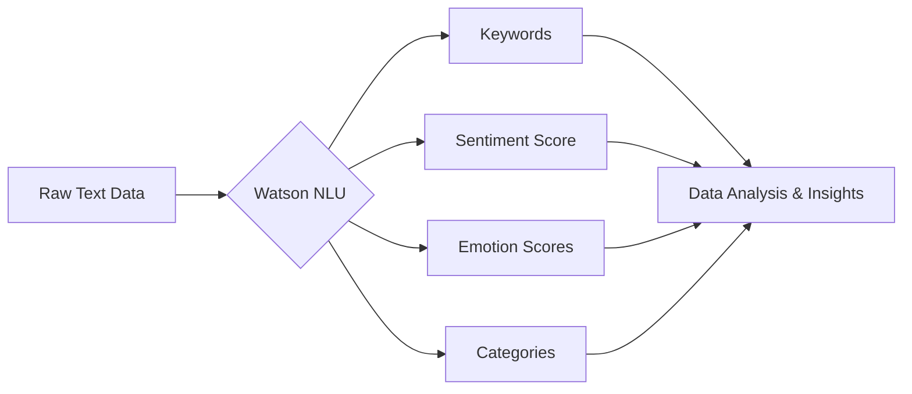
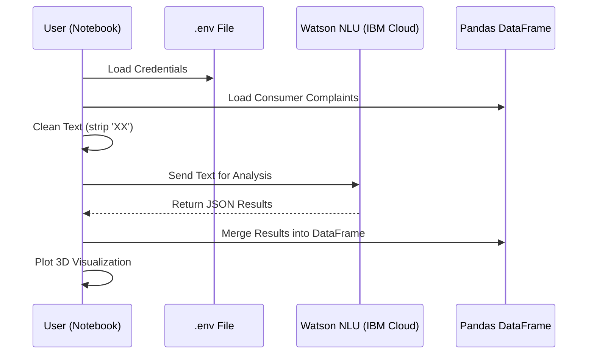

# Watson Natural Language Understanding (NLU) - Beginner's Guide 🚀

Welcome! This project demonstrates how to use **IBM Watson Natural Language Understanding (NLU)** to extract meaning and insights from text data. Whether you're a student or a junior developer, this guide will help you understand "what's under the hood."

## 🧠 What is Watson NLU?

Imagine you have thousands of customer reviews. Reading them all would take weeks. Watson NLU is an AI service that "reads" them for you in seconds, identifying:

*   **Categories**: What is the text about? (e.g., Finance, Technology, Sports)
*   **Keywords**: What are the most important words or phrases?
*   **Sentiment**: Is the speaker happy, angry, or neutral?
*   **Emotion**: Is there sadness, joy, fear, disgust, or anger?

### The NLU Workflow



---

## 🛠️ Setup

### 1. Prerequisites
- Python 3.10+
- IBM Cloud Account (Free Tier available)
- Watson NLU Instance

### 2. Configuration
Create a file named `.env` in the root directory:

```env
IAM_KEY=your_actual_key_here
SERVICE_URL=your_service_url_here
```
> [!IMPORTANT]
> Do NOT use quotes around your key or URL in the `.env` file!

### 3. Installation
```bash
pip install ibm-watson ibm-cloud-sdk-core python-dotenv pandas matplotlib
```

---

## 📈 Learning Objectives

In the provided notebook (`NLU_Example_Enhanced.ipynb`), you will learn:

1.  **Authentication**: How to securely connect your code to an AI cloud service.
2.  **Data Cleaning**: Pre-processing text (removing noise like 'XX' characters) so the AI can understand it better.
3.  **Batch Processing**: How to send multiple rows of data to the service.
4.  **Visualization**: Turning abstract numbers (like an "anger score" of 0.85) into 3D charts that reveal business trends.

---

## 🧱 Project Architecture



---

## 💡 Key Terms for Beginners

-   **API (Application Programming Interface)**: Think of it as a waiter. You (the code) give an order (the text), and the API brings back the food (the results) from the kitchen (IBM Cloud).
-   **SDK (Software Development Kit)**: A set of tools that make it easier to talk to the API.
-   **Dataframe**: A fancy name for an Excel-like table inside Python (using the `pandas` library).

---

Happy Coding! 👩‍💻👨‍💻
