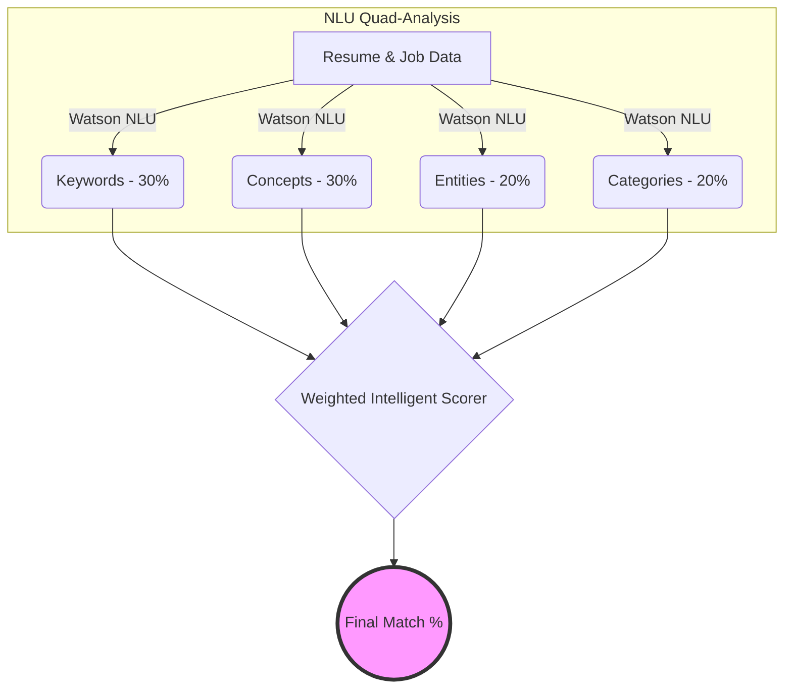

# Student Lab: Advanced Resume Analysis with Watson NLU

Welcome to the Advanced NLU Resume Matcher lab! This lab demonstrates how to use **Semantic Intelligence** to evaluate resumes against job descriptions.

## 🧠 Beyond Keywords: Quad-Signal Analysis
Simple keyword matching often misses great candidates. This lab uses four distinct "Signals" from IBM Watson NLU to provide a human-like evaluation:



## How the Scores Work
1. **Keywords (30%)**: Exact technical terms (e.g., "Python", "Cloud").
2. **Concepts (30%)**: Deep thematic themes (e.g., matching "CI/CD" to "Automation").
3. **Entities (20%)**: Proper nouns like companies, specific job titles, and organizations.
4. **Categories (20%)**: Industry context (e.g., "Technology > Computing").

## Setup Instructions

1. **Environment**: Ensure `.env` is configured in the `resumes/` folder.
2. **Docs**: Job descriptions (`.txt`) and resumes (`.pdf`) are in the `docs/` folder.
3. **Install**:
   ```bash
   pip install ibm-watson python-dotenv pandas matplotlib pymupdf scikit-learn
   ```

## Learning Outcome
Compare the [Basic Lab](Resume_Match_Basic.ipynb) and the [Advanced Lab](Resume_Match_Advanced.ipynb). See how the match score moves from "shallow" (10%) to "intelligent" as it understands the weight of your experience.
